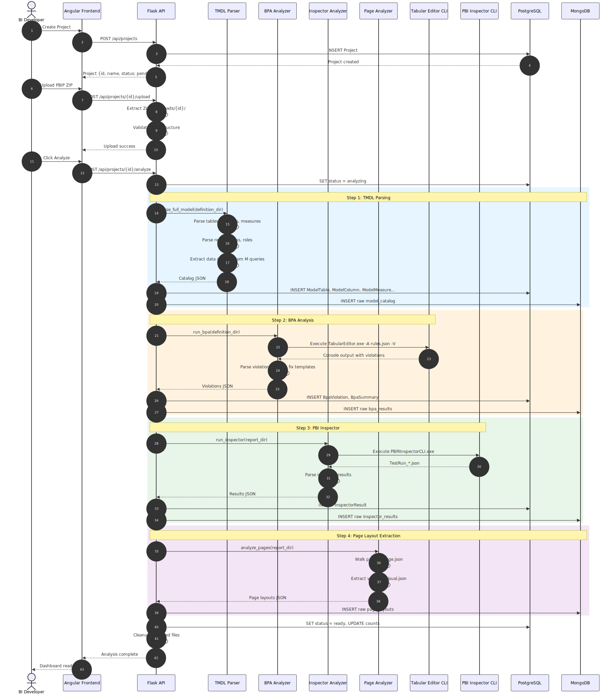

# BI Quality Analyzer — Project Documentation

> **Version**: 1.0 (POC)
> **Date**: April 2026
> **Epic**: Poc: BI Quality Tester Web App
> **Stack**: Angular 19 · Flask 3.1 · PostgreSQL · MongoDB

---

## Table of Contents

1. [Project Overview](#1-project-overview)
2. [Architecture](#2-architecture)
3. [Deployment Diagram](#3-deployment-diagram)
4. [Component Diagram](#4-component-diagram)
5. [Entity-Relationship Diagram](#5-entity-relationship-diagram)
6. [Class Diagrams](#6-class-diagrams)
7. [Use Case Diagram](#7-use-case-diagram)
8. [Analysis Pipeline](#8-analysis-pipeline)
9. [Data Lineage Flow](#9-data-lineage-flow)
10. [API Reference](#10-api-reference)
11. [Functional Specifications](#11-functional-specifications)
12. [Technical Specifications](#12-technical-specifications)
13. [Jira Tickets](#13-jira-tickets)

---

## 1. Project Overview

**BI Quality Analyzer** is a web-based portal that automates Power BI project quality assessment. A BI developer uploads a PBIP (Power BI Project) archive, and the system runs a multi-step analysis pipeline that produces:

| Module | Purpose |
|--------|---------|
| **Model Catalog** | Auto-documents tables, columns, measures, relationships, RLS roles, and partitions |
| **BPA (Best Practice Analysis)** | Detects model anti-patterns using Tabular Editor CLI + custom rule sets |
| **PBI Inspector** | Validates visual/report-level compliance using PBI Inspector CLI |
| **Data Lineage** | Traces data flow from sources → tables → columns → measures → visuals |
| **Page Layout Viewer** | Renders Power BI page layouts with visual positions and metadata |
| **Export** | Generates Excel reports for BPA, Inspector, and Catalog results |

### Key Metrics
- **9 database entities** across PostgreSQL
- **6 API blueprints** with 20+ endpoints
- **8 backend services** (parsers, analyzers, engine)
- **6 page components** + **5 shared components** in Angular
- **2 external CLI tools** integrated via subprocess

---

## 2. Architecture



### Architecture Layers

| Layer | Technology | Responsibility |
|-------|-----------|---------------|
| **Frontend** | Angular 19, Angular Material, SCSS | SPA with 6 page views, 5 shared components, 6 services |
| **API** | Flask 3.1, Flask-CORS | 6 blueprints, REST endpoints, file upload handling |
| **Services** | Python 3.12 | TMDL parsing, DAX analysis, BPA, Inspector, Lineage, Export |
| **ORM** | SQLAlchemy + Alembic | PostgreSQL models, migrations |
| **Document Store** | PyMongo | Raw analysis results (model_catalog, bpa_results, inspector_results, page_layouts) |
| **External Tools** | Tabular Editor CLI, PBI Inspector CLI | Subprocess-based analysis engines |
| **File Storage** | Local filesystem | PBIP uploads, BPA/Inspector rule JSON files |

---

## 3. Deployment Diagram


### Runtime Configuration

| Component | Port | Details |
|-----------|------|---------|
| Angular Dev Server | 4200 | `ng serve` with proxy to Flask |
| Flask Dev Server | 5000 | Debug mode with auto-reload |
| PostgreSQL | 5432 | Database: `bi_quality` |
| MongoDB | 27017 | Database: `bi_quality` |

### Environment Variables

| Variable | Description |
|----------|-------------|
| `DATABASE_URL` | PostgreSQL connection string |
| `MONGO_URI` | MongoDB connection string |
| `TABULAR_EDITOR_PATH` | Path to TabularEditor.exe |
| `PBI_INSPECTOR_PATH` | Path to PBI-Inspector.exe |
| `BPA_RULES_PATH` | Path to BPA rules JSON |
| `BPA_FIX_TEMPLATES_PATH` | Path to fix templates JSON |
| `PBI_INSPECTOR_RULES_PATH` | Path to Inspector rules JSON |
| `UPLOAD_FOLDER` | Directory for uploaded PBIP files |

---

## 4. Component Diagram



### Frontend Components

| Component | Route | Dependencies |
|-----------|-------|-------------|
| `ProjectListComponent` | `/projects` | ProjectService |
| `ProjectCreateComponent` | `/projects/new` | ProjectService |
| `ProjectOverviewComponent` | `/projects/:id` | ProjectService, BpaService, InspectorService, PageService |
| `ModelCatalogComponent` | `/projects/:id/catalog` | CatalogService, LineageService, ProjectService |
| `BpaViolationsComponent` | `/projects/:id/bpa` | BpaService, ProjectService |
| `InspectorResultsComponent` | `/projects/:id/inspector` | InspectorService, ProjectService |

### Shared Components

| Component | Purpose | Inputs |
|-----------|---------|--------|
| `SeverityBadgeComponent` | Color-coded severity labels | `label`, `tone` |
| `ChartCardComponent` | Horizontal bar chart card | `title`, `items[]` |
| `FilterPanelComponent` | Reusable filter container | `title` |
| `LineageRendererComponent` | SVG-based lineage graph | `nodes[]`, `edges[]`, `zoom` |
| `PageLayoutViewerComponent` | Power BI page layout viewer | `projectId`, `pages[]` |

---

## 5. Entity-Relationship Diagram



### Database Tables

| Table | Records Scope | Key Relationships |
|-------|--------------|-------------------|
| `project` | 1 per uploaded PBIP | Parent of all analysis entities |
| `model_table` | N per project | Contains columns + measures |
| `model_column` | N per table | Belongs to table + project |
| `model_measure` | N per table | Belongs to table + project |
| `model_relationship` | N per project | References from/to table+column |
| `model_role` | N per project | RLS filters as JSON |
| `bpa_violation` | N per project | Linked to BPA rules |
| `bpa_summary` | N per project | Aggregated violation counts |
| `inspector_result` | N per project | Pass/fail per page |

### MongoDB Collections

| Collection | Content |
|------------|---------|
| `model_catalog` | Full TMDL parse output (raw JSON) |
| `bpa_results` | Raw BPA violations + summary |
| `inspector_results` | Raw PBI Inspector test results |
| `page_layouts` | Page structure with visual metadata |
| `analysis_meta` | Configuration paths used during analysis |

---

## 6. Class Diagrams

### 6.1 Backend Models & Services



### 6.2 Frontend Components & Services



### Backend Service Summary

| Service | File | Purpose |
|---------|------|---------|
| `TmdlParser` | `tmdl_parser.py` | Parses TMDL files into structured catalog (tables, columns, measures, relationships, roles, dataSources) |
| `BpaAnalyzer` | `bpa_analyzer.py` | Executes Tabular Editor CLI, parses violations, matches fix templates |
| `InspectorAnalyzer` | `inspector_analyzer.py` | Executes PBI Inspector CLI, parses pass/fail results |
| `LineageEngine` | `lineage_engine.py` | Builds full lineage graph (nodes + edges), supports trace & impact queries |
| `DaxParser` | `dax_parser.py` | Regex-based DAX expression parser (measures, columns, tables) |
| `PageAnalyzer` | `page_analyzer.py` | Extracts visual layout data from Power BI report pages |
| `FixMatcher` | `fix_matcher.py` | Matches BPA rule IDs to fix templates with placeholder resolution |
| `ExportService` | `export_service.py` | Generates Excel workbooks (BPA, Inspector, Catalog) |

---

## 7. Use Case Diagram



### Actors

| Actor | Description | Key Use Cases |
|-------|-------------|---------------|
| **BI Developer** | Primary user, uploads and analyzes PBIP files | Create project, upload, analyze, browse catalog, view lineage |
| **Project Manager** | Views dashboards and exports reports | View overview, health radar, export Excel |
| **Admin** | Manages projects | Create/delete projects |

### Use Case Groups

#### UC: Project Management (5 use cases)
- UC1: Create Project
- UC2: Upload PBIP File (ZIP or folder)
- UC3: Run Analysis (triggers 4-step pipeline)
- UC4: View Project List
- UC5: Delete Project

#### UC: Quality Analysis (4 use cases)
- UC6: View BPA Violations (filterable by severity, category, rule, table, object type)
- UC7: Filter by Severity/Category
- UC8: View Fix Suggestions (template-based remediation steps)
- UC9: Export BPA Report to Excel

#### UC: Visual Inspection (4 use cases)
- UC10: View Inspector Results (pass/fail)
- UC11: Filter by Pass/Fail and Page
- UC12: View Page Layouts (visual positions)
- UC13: Export Inspector Report to Excel

#### UC: Model Documentation (6 use cases)
- UC14: Browse Tables/Columns (with metadata: type, hidden, format, folder)
- UC15: Browse Measures with DAX expressions
- UC16: View Relationships (cardinalities, cross-filter, active status)
- UC17: View RLS Roles with filter definitions
- UC18: View Partitions with M query expressions
- UC19: Export Catalog to Excel

#### UC: Data Lineage (4 use cases)
- UC20: View Full Lineage (all nodes + edges)
- UC21: Visual Trace (trace visual → sources)
- UC22: Measure Impact Analysis (measure → consumers)
- UC23: Column Impact Analysis (column → measures → visuals)

#### UC: Dashboard (3 use cases)
- UC24: View Project Overview (summary statistics)
- UC25: View Health Radar (model quality scores per category)
- UC26: View Quality Score (aggregate health metric)

---

## 8. Analysis Pipeline



### Pipeline Steps

| Step | Service | Input | Output | Storage |
|------|---------|-------|--------|---------|
| 1. TMDL Parsing | `TmdlParser` | PBIP definition directory | Catalog JSON (tables, columns, measures, relationships, roles, dataSources) | PostgreSQL + MongoDB |
| 2. BPA Analysis | `BpaAnalyzer` + Tabular Editor | Model definition path + BPA rules | Violations with severity, category, fix suggestions | PostgreSQL + MongoDB |
| 3. PBI Inspector | `InspectorAnalyzer` + PBI Inspector | Report directory + Inspector rules | Test results (pass/fail) per page/rule | PostgreSQL + MongoDB |
| 4. Page Layout | `PageAnalyzer` | Report directory | Page structures with visual positions/types | MongoDB only |

### Pipeline Flow
1. User creates a project and uploads a PBIP ZIP file
2. Backend extracts the ZIP and validates the PBIP structure
3. User clicks "Analyze" triggering `POST /api/projects/{id}/analyze`
4. Backend sets project status to `analyzing`
5. Steps 1-4 execute sequentially
6. On completion: status → `ready`, counts updated
7. On failure: status → `error`, error message stored
8. Uploaded files are cleaned up after analysis

---

## 9. Data Lineage Flow



### Lineage Node Types

| Type | Color | Description |
|------|-------|-------------|
| `dataSource` | Green (#4caf50) | External data connectors (SQL Server, SharePoint, etc.) |
| `table` | Blue (#1565c0) | Model tables |
| `column` | Light Blue (#42a5f5) | Table columns |
| `measure` | Amber (#f9a825) | DAX measures |
| `visual` | Purple (#9c27b0) | Report visuals |

### Lineage Edge Types

| Type | Description |
|------|-------------|
| `connects_to_source` | Table → Data Source |
| `belongs_to_table` | Column → Table |
| `defined_in_table` | Measure → Table |
| `references_column` | Measure → Column (via DAX) |
| `depends_on_measure` | Measure → Measure (via DAX) |
| `references_table` | Measure → Table (via DAX function) |
| `uses_field` | Visual → Measure/Column |
| `has_relationship` | Table → Table (model relationship) |

### Lineage Queries

| Query | Algorithm | Description |
|-------|-----------|-------------|
| **Full Lineage** | Complete graph | All nodes and edges in the model |
| **Visual Trace** | Reverse BFS from visual | Trace a visual back through measures/columns to data sources |
| **Measure Impact** | Forward BFS from measure | Find all visuals and dependent measures |
| **Column Impact** | Forward BFS from column | Find all measures and visuals using this column |

### DAX Parsing Strategy
The `DaxParser` uses regex-based extraction to identify references within DAX expressions:
- **Measure references**: `[MeasureName]` (unqualified)
- **Column references**: `'TableName'[ColumnName]` or `TableName[ColumnName]`
- **Table references**: `FUNCTION('TableName', ...)` for 50+ known DAX table functions
- String literals are stripped before parsing to avoid false matches

### M Query Connector Recognition
The lineage engine recognizes 19+ data source connector types from M query expressions:
`Sql.Database`, `GoogleBigQuery.Database`, `Snowflake.Databases`, `Oracle.Database`, `SharePoint.Files`, `Excel.Workbook`, `Csv.Document`, `Web.Contents`, `OData.Feed`, `AzureStorage.Blobs`, `Databricks.Catalogs`, and more.

---

## 10. API Reference

### Base URL: `http://localhost:5000/api/projects`

### Projects

| Method | Endpoint | Description | Request Body | Response |
|--------|----------|-------------|-------------|----------|
| `GET` | `/` | List all projects | — | `Project[]` with violation/inspector counts |
| `POST` | `/` | Create project | `{name, description?}` | `Project` |
| `GET` | `/:id` | Get project details | — | `Project` with summary stats |
| `DELETE` | `/:id` | Delete project | — | `{message}` |
| `POST` | `/:id/upload` | Upload PBIP ZIP | `FormData` with file | `{message}` |
| `POST` | `/:id/analyze` | Run analysis pipeline | — | `{message}` |
| `GET` | `/:id/health-radar` | Get health scores | — | `{axes: [{name, score, total, percentage}]}` |
| `GET` | `/:id/pages` | Get page layouts | — | `{pages[], bookmarks[]}` |

### Catalog

| Method | Endpoint | Description | Query Params |
|--------|----------|-------------|-------------|
| `GET` | `/:id/catalog` | Full catalog | `table?` |
| `GET` | `/:id/catalog/tables` | List tables | — |
| `GET` | `/:id/catalog/measures` | List measures | `table?, folder?, search?` |
| `GET` | `/:id/catalog/relationships` | List relationships | `table?, active?` |
| `GET` | `/:id/catalog/roles` | List roles | — |
| `GET` | `/:id/catalog/partitions` | List partitions | — |

### BPA

| Method | Endpoint | Description | Query Params |
|--------|----------|-------------|-------------|
| `GET` | `/:id/bpa` | Get violations | `severity?, category?, ruleId?, table?, objectType?` |
| `GET` | `/:id/bpa/summary` | Get summary | — |

### Inspector

| Method | Endpoint | Description | Query Params |
|--------|----------|-------------|-------------|
| `GET` | `/:id/inspector` | Get results | `passed?, page?, sort?` |

### Lineage

| Method | Endpoint | Description | Query Params |
|--------|----------|-------------|-------------|
| `GET` | `/:id/lineage` | Full lineage graph | — |
| `GET` | `/:id/lineage/visual-trace` | Trace visual to sources | `page, visual` |
| `GET` | `/:id/lineage/measure-impact` | Measure impact analysis | `measure` |
| `GET` | `/:id/lineage/column-impact` | Column impact analysis | `table, column` |
| `GET` | `/:id/lineage/visuals` | List visuals | — |
| `GET` | `/:id/lineage/measures` | List measures | — |
| `GET` | `/:id/lineage/tables` | List tables | — |
| `GET` | `/:id/lineage/columns` | List columns | `table` |

### Export

| Method | Endpoint | Description | Response |
|--------|----------|-------------|----------|
| `GET` | `/:id/export/bpa` | Export BPA to Excel | `.xlsx` file |
| `GET` | `/:id/export/inspector` | Export Inspector to Excel | `.xlsx` file |
| `GET` | `/:id/export/catalog` | Export Catalog to Excel | `.xlsx` multi-sheet file |

---

## 11. Functional Specifications

### FS-01: Project Management

**Objective**: Allow users to create, manage, and analyze Power BI projects.

**Functional Requirements**:
- FR-01.1: User can create a project with a name and optional description
- FR-01.2: User can upload a PBIP file as a ZIP archive or folder
- FR-01.3: System validates PBIP structure upon upload (checks for `.pbip`, `definition/` directory)
- FR-01.4: User can trigger analysis which runs the 4-step pipeline
- FR-01.5: Project status transitions: `pending` → `analyzing` → `ready` | `error`
- FR-01.6: User can view a list of all projects with summary counts
- FR-01.7: Admin can delete a project and all associated data (cascade)

### FS-02: Model Catalog Documentation

**Objective**: Auto-document the Power BI semantic model structure.

**Functional Requirements**:
- FR-02.1: System parses TMDL files to extract tables, columns, measures, relationships, roles
- FR-02.2: Tables display: name, hidden status, import mode, column/measure/partition counts
- FR-02.3: Columns display: name, data type, hidden, format string, description, display folder, source column
- FR-02.4: Measures display: name, DAX expression, format string, description, display folder
- FR-02.5: Relationships display: from/to table+column, cardinality, cross-filter direction, active status
- FR-02.6: RLS Roles display: name, filter expressions as JSON
- FR-02.7: Partitions display: table name, partition name, source type, M query expression
- FR-02.8: Catalog is exportable to multi-sheet Excel workbook

### FS-03: Best Practice Analysis (BPA)

**Objective**: Detect model anti-patterns and provide fix suggestions.

**Functional Requirements**:
- FR-03.1: System runs Tabular Editor CLI with custom BPA rules JSON
- FR-03.2: Violations display: rule name, category, severity (1-5), object type/name, table, description
- FR-03.3: Each violation has a fix suggestion with action steps (from fix templates)
- FR-03.4: Results filterable by severity, category, rule ID, table name, object type
- FR-03.5: Summary view shows violation count per rule
- FR-03.6: Auto-date tables (LocalDateTable_*, DateTableTemplate_*) are excluded
- FR-03.7: BPA report exportable to color-coded Excel

### FS-04: PBI Inspector

**Objective**: Validate report-level visual compliance.

**Functional Requirements**:
- FR-04.1: System runs PBI Inspector CLI with custom rules
- FR-04.2: Results display: rule name, description, page name, pass/fail status, expected/actual values
- FR-04.3: Results filterable by pass/fail and page name
- FR-04.4: Inspector report exportable to Excel

### FS-05: Data Lineage

**Objective**: Visualize data flow from sources to visuals.

**Functional Requirements**:
- FR-05.1: Full Lineage shows all nodes (dataSource, table, column, measure, visual) and edges
- FR-05.2: Visual Trace traces a selected visual back to its data sources via BFS
- FR-05.3: Measure Impact shows all visuals and measures affected by a selected measure
- FR-05.4: Column Impact shows all measures and visuals affected by a selected column
- FR-05.5: Lineage is rendered as interactive SVG with pan/zoom
- FR-05.6: Nodes are color-coded by type; edges show relationship labels
- FR-05.7: Engine caches results with 120-second TTL to avoid rebuilds

### FS-06: Dashboard & Health Radar

**Objective**: Provide at-a-glance project quality overview.

**Functional Requirements**:
- FR-06.1: Project Overview shows summary cards (tables, columns, measures, relationships, data sources, visuals)
- FR-06.2: Health Radar maps BPA categories to quality axes with percentage scores
- FR-06.3: BPA summary chart shows violation counts by category
- FR-06.4: Inspector summary shows pass/fail ratio
- FR-06.5: Page layout viewer renders visual positions on a scaled canvas

---

## 12. Technical Specifications

### TS-01: Frontend Architecture

| Aspect | Detail |
|--------|--------|
| Framework | Angular 19 (standalone components) |
| UI Library | Angular Material |
| Styling | SCSS with component-scoped styles |
| State Management | Component-level with RxJS Observables |
| HTTP Client | Angular HttpClient |
| Forms | Reactive Forms (FormControl) |
| Routing | Angular Router with lazy evaluation via `matTabContent` |
| SVG Rendering | Custom LineageRendererComponent (no external graph library) |

### TS-02: Backend Architecture

| Aspect | Detail |
|--------|--------|
| Framework | Flask 3.1 |
| ORM | SQLAlchemy with Flask-Migrate (Alembic) |
| NoSQL | PyMongo for MongoDB |
| CORS | Flask-CORS (permissive for development) |
| File Handling | ZIP extraction, PBIP structure validation |
| CLI Integration | `subprocess.run()` for Tabular Editor + PBI Inspector |
| Export | openpyxl for Excel generation |
| Caching | LRU cache for fix templates, TTL cache for lineage engine |

### TS-03: Database Schema

**PostgreSQL** (`bi_quality`):
- 9 tables with foreign key relationships
- Cascade delete from Project to all child entities
- JSON columns for flexible data (filters, fix_steps, expected, actual)
- Indexes on `project_id` for all child tables

**MongoDB** (`bi_quality`):
- 5 collections for raw analysis results
- Document-per-project pattern
- No schema enforcement (flexible for evolving analysis outputs)

### TS-04: External Tool Integration

**Tabular Editor CLI**:
```
TabularEditor.exe <model_definition_path> -A <bpa_rules_path> -V
```
- Output: Console text with violation lines
- Parsing: 3 regex patterns for different violation formats
- Timeout: Default subprocess timeout

**PBI Inspector CLI**:
```
PBI-Inspector.exe -fabricitem <report_path> -rules <rules_path> -formats JSON -output <output_dir>
```
- Output: `TestRun_*.json` file in output directory
- Polling: Up to 15 seconds for output file appearance

### TS-05: DAX Parsing

| Pattern | Regex | Example |
|---------|-------|---------|
| Measure reference | `(?<!')\[([^\]]+)\]` | `[Total Sales]` |
| Column reference | `'?([^']+)'?\[([^\]]+)\]` | `'DimProduct'[ProductName]` |
| Table reference | `FUNCTION\s*\(\s*'?([^',)]+)` | `FILTER('FactSales', ...)` |

### TS-06: Lineage Graph

| Property | Value |
|----------|-------|
| Algorithm | BFS (breadth-first search) for trace and impact queries |
| Max nodes per type (rendering) | 50 |
| Max edge labels | 180 |
| Layout | Column-based: left→right by node type |
| Edge rendering | Cubic Bezier curves |
| Interaction | Pan (mouse drag), Zoom (buttons), Hover highlighting |

---

## 13. Jira Tickets

### Epic: POC — BI Quality Tester Web App

---

#### STORY-001: Project Creation & Upload
**Type**: Story
**Priority**: High
**Story Points**: 5
**Description**: As a BI developer, I want to create a project and upload a PBIP ZIP file so that I can analyze my Power BI model.
**Acceptance Criteria**:
- [ ] Create project with name + description
- [ ] Upload PBIP as ZIP or folder
- [ ] Validate PBIP structure (check for .pbip file, definition/ directory)
- [ ] Display upload progress and success/error feedback
- [ ] Project appears in project list with "pending" status

---

#### STORY-002: Analysis Pipeline Execution
**Type**: Story
**Priority**: High
**Story Points**: 13
**Description**: As a BI developer, I want to trigger a full analysis on my uploaded PBIP so that the system generates quality insights.
**Acceptance Criteria**:
- [ ] Click "Analyze" triggers the 4-step pipeline
- [ ] Status transitions: pending → analyzing → ready/error
- [ ] TMDL parsing extracts tables, columns, measures, relationships, roles, data sources
- [ ] BPA analysis runs Tabular Editor CLI with custom rules
- [ ] PBI Inspector runs and produces pass/fail results
- [ ] Page layouts are extracted from report definition
- [ ] Results stored in PostgreSQL (structured) and MongoDB (raw)
- [ ] Summary counts updated on project record

---

#### STORY-003: Project Overview Dashboard
**Type**: Story
**Priority**: High
**Story Points**: 8
**Description**: As a project manager, I want to see a dashboard with summary statistics and quality health radar so that I can assess project quality at a glance.
**Acceptance Criteria**:
- [ ] Summary cards: tables, columns, measures, relationships, data sources, visuals
- [ ] Health radar chart with quality scores per BPA category
- [ ] BPA violation summary by severity
- [ ] Inspector pass/fail summary
- [ ] Page layout preview with visual positions

---

#### STORY-004: Model Catalog — Tables & Columns
**Type**: Story
**Priority**: Medium
**Story Points**: 5
**Description**: As a BI developer, I want to browse the model catalog (tables, columns) with metadata so that I can document my model.
**Acceptance Criteria**:
- [ ] Accordion-style table list with expand/collapse
- [ ] Each table shows: name, mode, hidden status, column/measure/partition counts
- [ ] Columns display: name, data type, hidden, format string, description, folder, source
- [ ] Search/filter capabilities
- [ ] Responsive grid layout

---

#### STORY-005: Model Catalog — Measures
**Type**: Story
**Priority**: Medium
**Story Points**: 5
**Description**: As a BI developer, I want to browse measures with their DAX expressions so that I can review measure logic.
**Acceptance Criteria**:
- [ ] Measures listed with name, table, expression, format string
- [ ] Filterable by table and display folder
- [ ] Search by measure name
- [ ] DAX expression displayed in readable format

---

#### STORY-006: Model Catalog — Relationships
**Type**: Story
**Priority**: Medium
**Story Points**: 3
**Description**: As a BI developer, I want to view model relationships so that I can understand table connections.
**Acceptance Criteria**:
- [ ] List from/to table+column, cardinality, cross-filter direction
- [ ] Filter by table name and active status
- [ ] Visual indicator for active vs inactive relationships

---

#### STORY-007: Model Catalog — RLS Roles
**Type**: Story
**Priority**: Low
**Story Points**: 2
**Description**: As a BI developer, I want to view Row-Level Security roles and their filter definitions.
**Acceptance Criteria**:
- [ ] List role names with JSON filter definitions
- [ ] Expandable view for complex filters

---

#### STORY-008: Model Catalog — Partitions
**Type**: Story
**Priority**: Low
**Story Points**: 3
**Description**: As a BI developer, I want to view table partitions with their M query expressions.
**Acceptance Criteria**:
- [ ] List tables with partition count
- [ ] Show partition name, source type, M query expression
- [ ] Accordion-style expansion per table

---

#### STORY-009: BPA Violations View
**Type**: Story
**Priority**: High
**Story Points**: 8
**Description**: As a BI developer, I want to view BPA violations with filtering and fix suggestions so that I can improve my model quality.
**Acceptance Criteria**:
- [ ] Violations listed with severity badge, category, rule name, object, description
- [ ] Filter by severity (1-5), category, rule ID, table, object type
- [ ] Each violation shows fix suggestion with action steps
- [ ] Summary chart by category
- [ ] Severity color coding (error=red, warning=yellow, info=blue)

---

#### STORY-010: BPA Export to Excel
**Type**: Story
**Priority**: Medium
**Story Points**: 3
**Description**: As a project manager, I want to export BPA violations to Excel so that I can share them with the team.
**Acceptance Criteria**:
- [ ] Download .xlsx file with all violations
- [ ] Columns: Severity, Category, Rule Name, Object, Type, Table, Description, Fix Action, Fix Steps
- [ ] Color-coded rows by severity
- [ ] Styled header row

---

#### STORY-011: Inspector Results View
**Type**: Story
**Priority**: High
**Story Points**: 5
**Description**: As a BI developer, I want to view PBI Inspector results with pass/fail filtering.
**Acceptance Criteria**:
- [ ] Results listed with rule name, description, page, pass/fail status
- [ ] Filter by pass/fail and page name
- [ ] Expected vs actual values displayed
- [ ] Pass/fail summary cards

---

#### STORY-012: Inspector Export to Excel
**Type**: Story
**Priority**: Medium
**Story Points**: 2
**Description**: As a project manager, I want to export inspector results to Excel.
**Acceptance Criteria**:
- [ ] Download .xlsx file with all results
- [ ] Color-coded failed tests
- [ ] Styled headers

---

#### STORY-013: Catalog Export to Excel
**Type**: Story
**Priority**: Medium
**Story Points**: 3
**Description**: As a project manager, I want to export the full model catalog to a multi-sheet Excel workbook.
**Acceptance Criteria**:
- [ ] Sheets: Tables, Measures, Relationships, Roles
- [ ] Each sheet properly formatted with headers
- [ ] Download as .xlsx

---

#### STORY-014: Full Data Lineage
**Type**: Story
**Priority**: High
**Story Points**: 13
**Description**: As a BI developer, I want to view the full data lineage graph showing all objects and their dependencies.
**Acceptance Criteria**:
- [ ] SVG-based graph with all nodes (dataSource, table, column, measure, visual)
- [ ] Color-coded nodes by type
- [ ] Edges with relationship labels
- [ ] Pan and zoom controls
- [ ] Performance: max 50 nodes per type, max 180 edge labels

---

#### STORY-015: Visual Trace
**Type**: Story
**Priority**: High
**Story Points**: 8
**Description**: As a BI developer, I want to trace a visual back to its data sources to understand the complete data pipeline.
**Acceptance Criteria**:
- [ ] Select a visual from dropdown (page + visual name)
- [ ] BFS traversal from visual → measures → columns → tables → data sources
- [ ] Highlighted subgraph in SVG renderer
- [ ] Shows only relevant nodes and edges

---

#### STORY-016: Measure Impact Analysis
**Type**: Story
**Priority**: Medium
**Story Points**: 5
**Description**: As a BI developer, I want to see which visuals and measures depend on a selected measure.
**Acceptance Criteria**:
- [ ] Select measure from dropdown
- [ ] Forward BFS from measure to consumers
- [ ] Shows dependent measures and visuals
- [ ] Impact subgraph rendered in SVG

---

#### STORY-017: Column Impact Analysis
**Type**: Story
**Priority**: Medium
**Story Points**: 5
**Description**: As a BI developer, I want to see which measures and visuals use a selected column.
**Acceptance Criteria**:
- [ ] Select table then column from dropdowns
- [ ] Forward BFS from column → measures → visuals
- [ ] Impact subgraph rendered in SVG

---

#### STORY-018: Page Layout Viewer
**Type**: Story
**Priority**: Medium
**Story Points**: 5
**Description**: As a BI developer, I want to see the layout of Power BI report pages with visual positions.
**Acceptance Criteria**:
- [ ] Select page from dropdown
- [ ] Scaled canvas showing visual positions and sizes
- [ ] Color-coded by visual type (slicer, chart, table, card, etc.)
- [ ] Hover to see visual details (name, type, fields)

---

#### STORY-019: TMDL Parser Service
**Type**: Task
**Priority**: High
**Story Points**: 8
**Description**: Implement TMDL file parsing to extract semantic model structure.
**Acceptance Criteria**:
- [ ] Parse tables with columns, measures, partitions
- [ ] Parse relationships with cardinalities
- [ ] Parse RLS roles with filters
- [ ] Extract data sources from M query expressions
- [ ] Handle quoted identifiers and multi-line expressions

---

#### STORY-020: DAX Parser Service
**Type**: Task
**Priority**: Medium
**Story Points**: 5
**Description**: Implement regex-based DAX expression parsing for lineage extraction.
**Acceptance Criteria**:
- [ ] Extract measure references: `[MeasureName]`
- [ ] Extract column references: `'Table'[Column]`
- [ ] Extract table references from 50+ DAX functions
- [ ] Strip string literals before parsing
- [ ] Handle edge cases (nested expressions, quoted names)

---

#### STORY-021: Lineage Engine Service
**Type**: Task
**Priority**: High
**Story Points**: 13
**Description**: Build the lineage graph engine that combines TMDL, DAX, and page layout data.
**Acceptance Criteria**:
- [ ] Build node graph from PostgreSQL + MongoDB data
- [ ] Recognize 19+ M query connector types
- [ ] BFS traversal for trace and impact queries
- [ ] Engine caching with 120s TTL
- [ ] Support full lineage, visual trace, measure impact, column impact queries

---

#### STORY-022: Health Radar Scoring
**Type**: Task
**Priority**: Medium
**Story Points**: 3
**Description**: Calculate model health scores from BPA violations by category.
**Acceptance Criteria**:
- [ ] Map BPA categories to radar axes
- [ ] Calculate percentage score per axis (violations vs total rules)
- [ ] Return radar data for frontend chart rendering

---

#### STORY-023: Fix Template System
**Type**: Task
**Priority**: Low
**Story Points**: 3
**Description**: Match BPA violations to fix templates with placeholder resolution.
**Acceptance Criteria**:
- [ ] Load templates from JSON configuration
- [ ] Replace `{table}` and `{object}` placeholders
- [ ] Return action + steps for each violation
- [ ] LRU cache for template loading

---

#### STORY-024: Database Schema & Migrations
**Type**: Task
**Priority**: High
**Story Points**: 5
**Description**: Design and implement the PostgreSQL schema with SQLAlchemy models and Alembic migrations.
**Acceptance Criteria**:
- [ ] 9 tables with proper relationships and foreign keys
- [ ] Cascade delete from Project
- [ ] JSON columns for flexible data
- [ ] Migration scripts generated and tested

---

#### STORY-025: MongoDB Integration
**Type**: Task
**Priority**: Medium
**Story Points**: 3
**Description**: Store raw analysis results in MongoDB for flexible querying and audit trail.
**Acceptance Criteria**:
- [ ] Collections: model_catalog, bpa_results, inspector_results, page_layouts, analysis_meta
- [ ] Insert raw JSON from each analysis step
- [ ] Query by project_id

---

#### STORY-026: Project Delete & Cleanup
**Type**: Task
**Priority**: Low
**Story Points**: 2
**Description**: Implement project deletion with cascade cleanup across all stores.
**Acceptance Criteria**:
- [ ] Delete all PostgreSQL records (cascade)
- [ ] Delete MongoDB documents
- [ ] Clean up uploaded files from filesystem

---

### Sprint Planning Suggestion

| Sprint | Stories | Total Points | Theme |
|--------|---------|-------------|-------|
| Sprint 1 | STORY-024, STORY-025, STORY-019, STORY-001, STORY-002 | 34 | Foundation: DB, Parser, Upload, Pipeline |
| Sprint 2 | STORY-003, STORY-004, STORY-005, STORY-006, STORY-007 | 23 | Catalog & Dashboard |
| Sprint 3 | STORY-009, STORY-010, STORY-011, STORY-012, STORY-022, STORY-023 | 24 | BPA & Inspector |
| Sprint 4 | STORY-020, STORY-021, STORY-014, STORY-015 | 39 | Lineage Core |
| Sprint 5 | STORY-016, STORY-017, STORY-018, STORY-008, STORY-013, STORY-026 | 20 | Lineage Advanced & Polish |

---

## Appendix A: File Structure

```
poc-portail/
├── backend/
│   ├── app/
│   │   ├── __init__.py              # Flask app factory, blueprint registration
│   │   ├── config.py                # Configuration (DB URLs, tool paths)
│   │   ├── models/
│   │   │   ├── project.py           # Project model
│   │   │   ├── catalog.py           # ModelTable, ModelColumn, ModelMeasure, ModelRelationship, ModelRole
│   │   │   ├── bpa.py               # BpaViolation, BpaSummary
│   │   │   └── inspector.py         # InspectorResult
│   │   ├── routes/
│   │   │   ├── projects.py          # Project CRUD + analysis pipeline
│   │   │   ├── catalog.py           # Catalog queries
│   │   │   ├── bpa.py               # BPA violations + summary
│   │   │   ├── inspector.py         # Inspector results
│   │   │   ├── lineage.py           # Lineage graph + trace/impact queries
│   │   │   └── export.py            # Excel export endpoints
│   │   └── services/
│   │       ├── tmdl_parser.py       # TMDL file parsing
│   │       ├── bpa_analyzer.py      # Tabular Editor CLI integration
│   │       ├── inspector_analyzer.py # PBI Inspector CLI integration
│   │       ├── lineage_engine.py    # Lineage graph builder + BFS queries
│   │       ├── dax_parser.py        # DAX expression regex parser
│   │       ├── page_analyzer.py     # Page layout extraction
│   │       ├── fix_matcher.py       # BPA fix template matching
│   │       └── export_service.py    # Excel workbook generation
│   ├── migrations/                   # Alembic migration scripts
│   └── run.py                        # Flask entry point
├── frontend/
│   └── src/app/
│       ├── app.component.ts          # Root component
│       ├── app.routes.ts             # Route definitions
│       ├── pages/
│       │   ├── project-list/         # Project listing
│       │   ├── project-create/       # Project creation + upload
│       │   ├── project-overview/     # Dashboard with health radar
│       │   ├── model-catalog/        # Catalog + Lineage (tabbed)
│       │   ├── bpa-violations/       # BPA violations with filters
│       │   └── inspector-results/    # Inspector results with filters
│       ├── services/
│       │   ├── project.service.ts
│       │   ├── bpa.service.ts
│       │   ├── catalog.service.ts
│       │   ├── inspector.service.ts
│       │   ├── lineage.service.ts
│       │   └── page.service.ts
│       └── shared/
│           ├── components/
│           │   ├── severity-badge/
│           │   ├── chart-card/
│           │   ├── filter-panel/
│           │   ├── lineage-renderer/
│           │   └── page-layout-viewer/
│           └── models/
│               └── api.models.ts     # TypeScript interfaces
├── docs/
│   ├── PROJECT_DOCUMENTATION.md      # This file
│   └── diagrams/
│       ├── *.mmd                     # Mermaid source files
│       └── svg/                      # Generated SVG diagrams
└── rules/
    ├── bpa-rules.json                # BPA rule definitions
    ├── bpa-fix-templates.json        # Fix suggestion templates
    └── pbi-inspector-rules.json      # Inspector rule definitions
```

---

## Appendix B: Technology Stack

| Category | Technology | Version |
|----------|-----------|---------|
| Frontend Framework | Angular | 19 |
| UI Components | Angular Material | 19 |
| Frontend Language | TypeScript | 5.x |
| Backend Framework | Flask | 3.1 |
| Backend Language | Python | 3.12 |
| ORM | SQLAlchemy | 2.x |
| Migrations | Alembic (Flask-Migrate) | Latest |
| Relational DB | PostgreSQL | 16 |
| Document DB | MongoDB | 7.x |
| BPA Engine | Tabular Editor CLI | 3.x |
| Inspector Engine | PBI Inspector CLI | Latest |
| Excel Export | openpyxl | Latest |
| API Protocol | REST over HTTP | JSON |

---

*Generated on April 2, 2026*
